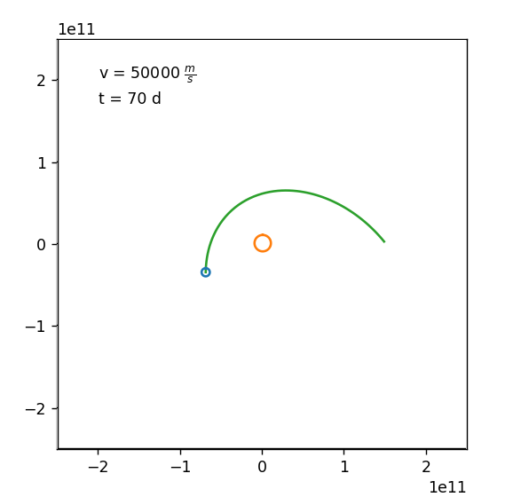

# Simulationen Keplersche Gesetze

---

Simulationen zu den Keplerschen Gesetzen:

1. Gravitationsgesetz
   1. Nachweis [Kepler I](#kepler-i)
   2. Grundlage 2. Gesetz
2. [Kepler II](#kepler-ii)
   1. Flächen konstant
   2. Schneller in Sonnennähe
   3. Gravitationsmodell von 1. übernehmen

---
## Veränderungen

Veränderungen bitte in separatem branch.
Jede Änderung so schnell wie möglich pushen. 

---
## Zeitplan

- [x] Do: erste Version 2. Kepler
- [x] Fr: Stabile Version
- [x] Sa: Dokumentation
- [x] Sa/So: Tests

---
### Kepler I

> Alle Planeten bewegen sich auf elliptischen Bahnen. In einem der Brennpunkte steht die Sonne

### Kepler II

> Der Quotient aus der vom Leitstrahl Sonne - Planet überstrichenen
> Fläche und der dazu erforderlichen Zeit ist konstant.

### Kepler III

> Die Quadrate der Umlaufzeiten zweier Planeten verhalten sich
> wie die dritten Potenzen der großen Halbachsen ihrer Bahnen

---
## Quellen

* [https://nssdc.gsfc.nasa.gov/planetary/factsheet/earthfact.html](https://nssdc.gsfc.nasa.gov/planetary/factsheet/earthfact.html)
  * Entfernung Erde - Sonne
  * Geschwindigkeit Erde
* Oliver Natt. Physik mit Python. Springer Spektrum. 2020
  * Grundlagen Simulation und Animation mit Python
